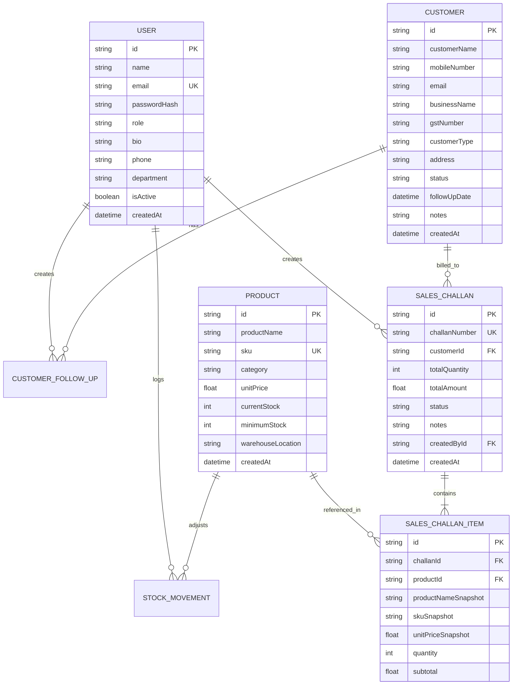

# DistribuERP - Complete System Architecture & API Documentation

> **Project**: Mini ERP + CRM Operations Portal for Wholesale and Distribution  
> **Version**: 1.0.0  
> **GitHub**: [https://github.com/sandeepj-git567/ERP-CRM-system](https://github.com/sandeepj-git567/ERP-CRM-system)  
> **Video Demonstration**: [Watch Loom Recording](https://www.loom.com/share/96916c5f53bf408e80febd5ea6a786d1)  
> **Live Backend API**: `https://erp-crm-system.onrender.com/api`  

---

## 📑 Table of Contents
1. [System Overview & Domain Context](#1-system-overview--domain-context)
2. [Architecture Diagrams & Topology](#2-architecture-diagrams--topology)
3. [Role-Based Access Control (RBAC) Matrix](#3-role-based-access-control-rbac-matrix)
4. [Database Schema & ER Model](#4-database-schema--er-model)
5. [Core Business Workflows & State Machines](#5-core-business-workflows--state-machines)
6. [Complete REST API Reference](#6-complete-rest-api-reference)
7. [Real-Time WebSocket Protocol](#7-real-time-websocket-protocol)
8. [Multi-Channel Notification & Export Engine](#8-multi-channel-notification--export-engine)
9. [DevOps, Docker & Cloud Deployment](#9-devops-docker--cloud-deployment)
10. [Test & Verification Report](#10-test--verification-report)

---

## 1. System Overview & Domain Context

**DistribuERP** is an integrated operations and CRM portal built for wholesale distribution companies. It unifies four mission-critical departments into a single synchronous workspace:
- **Sales & Field CRM**: Customer relationship management, lead conversion, follow-up timelines, and delivery challan creation.
- **Warehouse & Logistics**: Real-time stock valuation, physical inventory counts, threshold alerts, and inbound/outbound movement auditing.
- **Accounts & Finance**: Confirmed sales ledger reconciliation, company branding & GST compliance, and 1-click GSTR-1 / sales tax exports.
- **Administration & Security**: User provisioning, role-specific territory and bio configuration, and live system monitoring.

---

## 2. Architecture Diagrams & Topology

```
┌────────────────────────────────────────────────────────────────────────────────────────┐
│                                DISTRIBUERP ARCHITECTURE                                │
└────────────────────────────────────────────────────────────────────────────────────────┘
                                            │
               ┌────────────────────────────┴────────────────────────────┐
               ▼                                                         ▼
  ┌─────────────────────────┐                               ┌─────────────────────────┐
  │   React 18 + Vite SPA   │ ◄────────────────────────────►│  Node.js + Express API  │
  │   (TailwindCSS Glass)   │       REST (HTTP) + WS        │  (TypeScript + Zod)     │
  │ - Role-Tailored Portals │                               │ - Socket.IO WebSockets  │
  │ - Dynamic Bio & CRM     │                               │ - JWT Auth & Rate Limit │
  │ - GSTR-1 / CSV Engine   │                               │ - Prisma ORM Layer      │
  └─────────────────────────┘                               └────────────┬────────────┘
                                                                         │
                                                                         ▼
                                                            ┌─────────────────────────┐
                                                            │ PostgreSQL (Supabase)   │
                                                            │ - Atomic Transactions   │
                                                            │ - Serial Counters       │
                                                            │ - Snapshot Integrity    │
                                                            └─────────────────────────┘
```

---

## 3. Role-Based Access Control (RBAC) Matrix

| Module / Action | Admin | Sales | Warehouse | Accounts |
| :--- | :---: | :---: | :---: | :---: |
| **Authentication & Sign Up** | Full | Full | Full | Full |
| **Profile & Bio Customization** | Full | Full | Full | Full |
| **Customer CRM (View/Search)** | ✅ | ✅ | ❌ | ✅ |
| **Customer CRM (Create/Edit)** | ✅ | ✅ | ❌ | ❌ |
| **CRM Follow-Up Logging** | ✅ | ✅ | ❌ | ❌ |
| **Products Catalogue (View)** | ✅ | ✅ | ✅ | ✅ |
| **Products (Create/Edit SKU)** | ✅ | ❌ | ✅ | ❌ |
| **Stock Movement Log (IN/OUT)**| ✅ | ❌ | ✅ | ❌ |
| **Sales Challans (View List)** | ✅ | ✅ | ✅ | ✅ |
| **Sales Challan (Create Draft)**| ✅ | ✅ | ❌ | ❌ |
| **Sales Challan (Confirm/Cancel)**| ✅ | ✅ | ❌ | ❌ |
| **Dispatch Modal (WhatsApp/SMS)**| ✅ | ✅ | ✅ | ✅ |
| **1-Click GSTR-1 & Sales Exports**| ✅ | ✅ | ✅ | ✅ |
| **Company Branding & GST Setup** | ✅ | ❌ | ❌ | ✅ |
| **Staff & User Management** | ✅ | ❌ | ❌ | ❌ |

---

## 4. Database Schema & ER Model



---

## 5. Core Business Workflows & State Machines

### 1. Atomic Stock Deduction Workflow
When a sales user confirms a delivery challan:
1. An atomic PostgreSQL transaction begins (`prisma.$transaction`).
2. For each line item, the system verifies:
   $$\text{Current Stock} \ge \text{Requested Quantity}$$
3. If stock is insufficient, the transaction rolls back immediately with code `INSUFFICIENT_STOCK`.
4. If stock is sufficient:
   - Stock is decremented: $\text{Current Stock} = \text{Current Stock} - \text{Quantity}$
   - An immutable `StockMovement` audit record (`movementType: 'OUT'`) is created.
   - Challan status changes to `CONFIRMED`.
   - Real-time WebSocket event `CHALLAN_CONFIRMED` broadcasts to all connected clients.

### 2. Snapshot Data Preservation
Invoices and challans must remain historically accurate even if product prices or SKUs change later:
- Each `SalesChallanItem` stores immutable copies: `productNameSnapshot`, `skuSnapshot`, and `unitPriceSnapshot`.

---

## 6. Complete REST API Reference

Base URL: `http://localhost:5000/api` or `https://erp-crm-system.onrender.com/api`

### Authentication Endpoints
- `POST /auth/login`: Authenticate staff with email & password, returns JWT.
- `POST /auth/register`: Public registration supporting role, phone, department, and personal bio.
- `GET /auth/me`: Get current logged-in user profile with role permissions.
- `PUT /auth/profile`: Update user name, phone, bio, department, and change password.

### Customer CRM Endpoints
- `GET /customers?page=1&limit=10&search=&status=&type=`: List paginated customer records.
- `POST /customers`: Create a new customer record.
- `GET /customers/:id`: Retrieve single customer record with follow-up timeline and challan history.
- `PUT /customers/:id`: Update customer details.
- `POST /customers/:id/follow-ups`: Add a follow-up note to customer CRM timeline.

### Product & Inventory Endpoints
- `GET /products?page=1&limit=20&search=&category=`: List products catalogue.
- `POST /products`: Create new product SKU with threshold alerts.
- `GET /products/:id`: Get product details and recent stock movement history.
- `PUT /products/:id`: Update product pricing and threshold limits.
- `POST /products/:id/stock`: Record stock movement (`IN` or `OUT`) with reason.

### Sales Challans Endpoints
- `GET /challans?page=1&limit=10&status=&customerId=`: List sales challans.
- `POST /challans`: Create a draft delivery challan with auto-generated serial ID (`CH-YYYY-XXXXXX`).
- `GET /challans/:id`: Get challan detail with customer metadata and item snapshots.
- `POST /challans/:id/confirm` (or `PATCH`): Confirm challan and atomically deduct inventory.
- `POST /challans/:id/cancel` (or `PATCH`): Cancel challan and restore stock if previously confirmed.

### Dashboard & Analytics Endpoints
- `GET /dashboard/stats`: Retrieve live KPI metrics (Total Customers, Active Accounts, Product Count, Low Stock Count, Monthly Confirmed Revenue).

---

## 7. Real-Time WebSocket Protocol

Server events are broadcast across namespaces on port 5000:

| Event Name | Trigger Condition | Payload Data |
| :--- | :--- | :--- |
| `USER_CREATED` | New staff member registered | User ID, Name, Role, Bio |
| `CUSTOMER_CREATED` | New CRM customer added | Customer ID, Business, Mobile |
| `CUSTOMER_UPDATED` | Customer details/status changed | Updated Customer Object |
| `STOCK_MOVEMENT` | Physical stock movement logged | Product SKU, Quantity, Movement Type |
| `CHALLAN_CREATED` | New delivery challan drafted | Challan #, Customer Name, Total INR |
| `CHALLAN_CONFIRMED`| Delivery challan confirmed | Challan #, Deducted Items, Revenue |

---

## 8. Multi-Channel Notification & Export Engine

- **WhatsApp Click-to-Chat (`https://wa.me/`)**: Automatically formats itemized dispatch summaries and opens the customer's chat directly.
- **Email Invoice (`mailto:`)**: Generates formatted invoice emails with company bank details and settlement instructions.
- **DLT SMS**: Generates single-segment SMS templates for telecom gateways.
- **1-Click GSTR-1 Sales CSV**: Generates standard tax-filing exports calculating taxable base, CGST (9%), SGST (9%), and total revenue.
- **Stock Valuation CSV**: Exports inventory asset valuation across all SKUs.

---

## 9. DevOps, Docker & Cloud Deployment

### Docker 1-Command Execution:
```bash
docker-compose up --build
```

### Cloud Deployment:
- **Backend (Render)**:
  - Build Command: `npm install && npx prisma generate && npm run build`
  - Start Command: `npm start`
  - Environment: `DATABASE_URL`, `JWT_SECRET`, `NODE_ENV=production`
- **Frontend (Vercel)**:
  - Framework: `Vite`
  - Root: `client`
  - Environment: `VITE_API_URL`, `VITE_WS_URL`

---

## 10. Test & Verification Report

- **Backend Unit & Integration Tests (Jest)**: **21/21 passed** (`tests/auth.test.ts`, `tests/challan.test.ts`).
- **Live 10-Flow E2E Audit Script (`test-all-flows.js`)**: **10/10 flows passed 100%**.
- **Frontend Production Build**: `tsc -b && vite build` compiled in 6.97s with **0 errors**.
